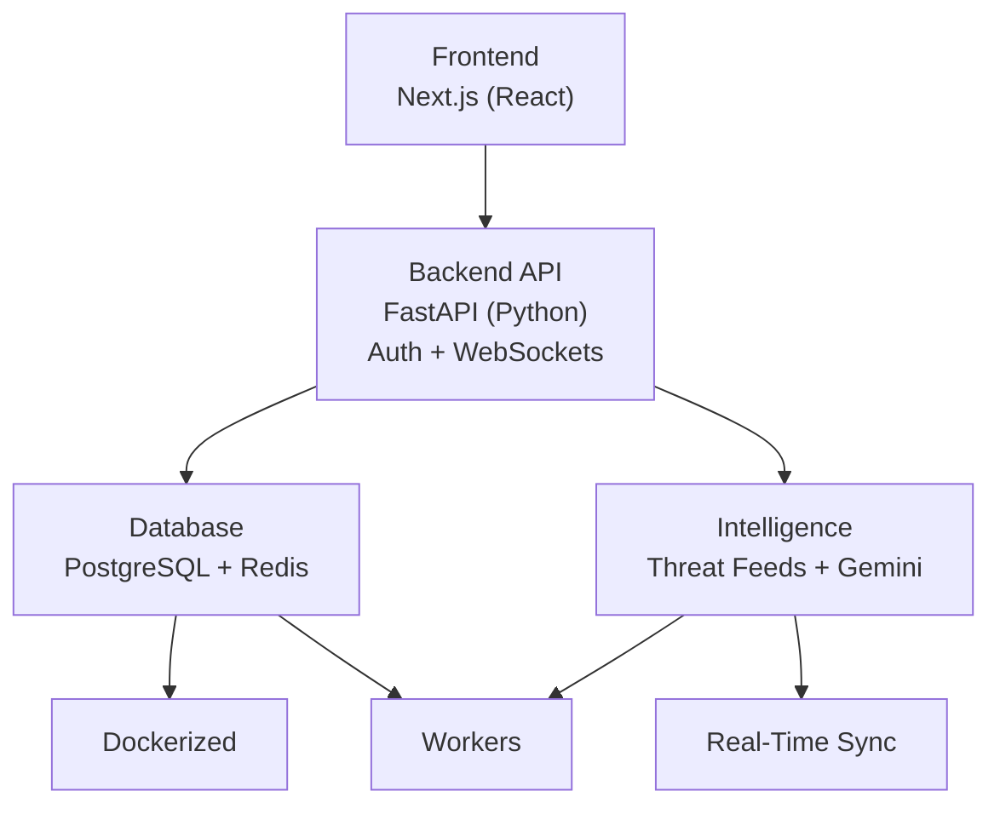

# CyberNews Product Roadmap

Source: `Cybernews.pdf`

## Product Vision

CyberNews should grow from a school project into a professional cyber threat intelligence and SOC-style dashboard.

The product should combine:

- Cybersecurity news aggregation
- Threat intelligence feeds
- CVE and vulnerability tracking
- IOC tracking
- Role-based analyst workflows
- AI-assisted analysis
- Incident management
- Real-time monitoring

## Product Identity

CyberNews is a:

- **CTI platform:** A cyber threat intelligence ecosystem.
- **SOC dashboard:** A security operations interface.
- **News and feed aggregator:** A central place for cybersecurity news and CVE feeds.
- **IOC tracker:** A place to collect and review indicators of compromise.
- **AI analysis tool:** A system that can summarize and classify threats.
- **Monitoring tool:** A dashboard for live updates and response.

## Main Goals

1. Build a professional cybersecurity dashboard.
2. Practice frontend and backend development.
3. Integrate real threat intelligence feeds.
4. Implement authentication and role-based access control.
5. Use AI to summarize and analyze threats.
6. Simulate SOC workflows.

## Target Architecture

The presentation describes an advanced target architecture:

- **Frontend:** Next.js and React
- **Backend API:** FastAPI with Python
- **Authentication:** JWT, API keys, secure sessions
- **Database:** PostgreSQL
- **Cache / queue support:** Redis
- **Intelligence feeds:** Threat feeds, CVE data, and AI enrichment
- **Real-time updates:** WebSockets
- **Workers:** Dockerized background jobs



## Current Project Reality

This school project currently uses:

- Flask
- Jinja templates
- Simple HTML, CSS, and JavaScript
- In-memory sessions and tokens
- NewsAPI integration
- Local mock intelligence data

For now, we should keep the implementation simple and beginner-friendly. The roadmap can guide feature choices without forcing a large framework migration too early.

## Core Features To Build Toward

### News Aggregation

Collect and display cybersecurity news from sources such as:

- NewsAPI
- BSI WID RSS
- The Hacker News
- SecurityWeek
- RSS feeds

Near-term idea:

- First connect the current dashboard to live NewsAPI data.
- Then add one more cybersecurity-specific source, preferably the BSI WID RSS feed.
- Keep source filters, refresh state, and readable article cards.

### CVE Intelligence Dashboard

Track vulnerabilities and show:

- CVE ID
- Severity
- Short description
- Published date
- Exploit status
- Patch or mitigation link

Near-term idea:

- Add mock CVE data first, then later connect a real CVE source.

### IOC Management

Track indicators of compromise such as:

- IP addresses
- Domains
- Hashes
- URLs
- Email addresses

Near-term idea:

- Add an admin-only page for entering simple IOC records.

### MITRE ATT&CK Mapping

Map threats to tactics, techniques, and procedures.

Near-term idea:

- Start with a simple text field such as `technique`, for example `Phishing` or `Credential Access`.

### Incident Workflow

Create simple SOC-style cases with:

- Title
- Severity
- Status
- Assigned analyst
- Timeline notes
- Linked IOCs

Near-term idea:

- Add a basic incident list visible to logged-in users.
- Add admin-only create/delete controls.

### AI-Assisted Analysis

Use AI for:

- Threat article summaries
- IOC extraction
- Severity classification
- MITRE ATT&CK suggestions
- Detection rule generation
- Remediation recommendations

Near-term idea:

- First create a mock AI summary button.
- Later connect a real AI API once the basic workflow is clear.

## Authentication And Security

The presentation highlights:

- Secure login
- Role-based access control
- JWT authentication
- API key support
- Audit logging
- Secure sessions
- Password hashing

Current project status:

- Login exists.
- Server-side sessions exist.
- Role checks exist.
- Bearer token API exists.
- Passwords are still hardcoded and plain text.

Near-term improvements:

- Hash passwords.
- Add an audit log for login success and failure.
- Add clearer access denied pages.
- Keep session and token behavior easy to explain.

## Threat Intelligence Integration

Target sources:

- The Hacker News
- SecurityWeek
- BSI WID RSS
- CISA KEV Catalog
- EPSS scoring
- CVE enrichment
- IOC extraction

Near-term idea:

- Add NewsAPI first because the key is already available.
- Add the BSI WID RSS feed next because it is cybersecurity-specific and does not need an API key.
- Normalize everything into a simple shared article shape:

```text
title
summary
source
url
published_at
category
```

### Data Source Evaluation

These are possible feeds and research links for CyberNews:

| Source | Fit | Priority | Notes |
| --- | --- | --- | --- |
| NewsAPI | General cybersecurity news | Now | Already planned for live dashboard news. Requires `NEWS_API_KEY`. Good for keyword searches like `cybersecurity`. |
| BSI WID RSS | Vulnerability/security advisories | Next | Strong fit. Official German security advisories, no API key, RSS/XML format, severity values like `niedrig`, `mittel`, `hoch`, `kritisch`. |
| NewsData.io | General news API alternative | Later | Useful fallback if NewsAPI limits become a problem. Requires another API key. Free latest news is delayed and limited per request. |
| Hacker News API | Tech community signal | Later | Free and near real-time, but not cybersecurity-specific and awkward to search by keyword. Better as a "community mentions" source later. |
| jaegeral/security-apis | Research catalog | Reference | Not a feed itself. Useful list for finding later APIs such as CVE, IP reputation, malware analysis, and threat intelligence sources. |
| NewsCatcher alternatives article | Research article | Reference | Good background for open-source news collection ideas, not an immediate data source for the app. |

Detailed findings:

- **NewsAPI**
  - Requires an API key.
  - Good first live source because `NEWS_API_KEY` is already available.
  - Best endpoint for CyberNews: `/v2/everything?q=cybersecurity&language=en&sortBy=publishedAt`.
  - Useful fields: `source.name`, `title`, `description`, `url`, `publishedAt`.
  - Limitation: this is general news search, not pure threat intelligence.
- **BSI WID RSS**
  - Best second source.
  - Feed URL tested: `https://wid.cert-bund.de/content/public/securityAdvisory/rss`
  - No API key needed.
  - RSS fields map cleanly to our data model: `title`, `link`, `description`, `category`, `pubDate`.
  - Severity values are German: `niedrig`, `mittel`, `hoch`, `kritisch`.
  - Strong fit for vulnerability and advisory data.
  - Limitation: content is German, so the UI should either show it as-is or label it clearly as BSI advisories.
- **NewsData.io**
  - General news API alternative.
  - Requires another API key.
  - The latest endpoint can query recent articles with parameters such as `q`, `country`, `language`, `domain`, and `category`.
  - Free latest-news results are delayed and limited per request.
  - Useful if NewsAPI limits become a problem, but not needed right now.
- **Hacker News API**
  - Free public API with near real-time Hacker News data.
  - No current rate limit is documented.
  - Useful fields include `id`, `title`, `url`, `score`, `time`, and `by`.
  - Limitation: it is not cybersecurity-specific and keyword search is awkward.
  - Better future use: "community signal" or "developer discussion" panel.
- **jaegeral/security-apis**
  - A curated list of public JSON security APIs.
  - Not a direct data feed.
  - Useful later for discovering CVE, hash lookup, IP reputation, DShield, GreyNoise, malware analysis, and other security APIs.
- **NewsCatcher alternatives article**
  - Useful research for open-source news collection.
  - Mentions options such as `newscatcher` and `pygooglenews`.
  - Not an immediate dependency for this app.

Recommended implementation order:

1. NewsAPI live news.
2. BSI WID RSS vulnerability advisories.
3. Admin-created reports shown on the dashboard.
4. Then graph/correlation based on the normalized data.

## SOC Dashboard Ideas

The product should eventually feel like a small SOC cockpit.

Possible sections:

- Latest headlines
- Active vulnerabilities
- IOC watchlist
- Recent incidents
- Analyst notes
- Admin controls
- Audit log

Keep the design practical:

- Clear navigation
- Compact cards or tables
- Simple colors
- Readable status labels
- No unnecessary visual complexity

## Threat Correlation Concepts

Threat correlation should connect different security entities into a graph:

```text
Article -> CVE -> IOC -> Incident -> Actor -> MITRE Technique -> Affected Asset
```

This would make CyberNews feel more like an intelligence platform than a normal news dashboard.

### Graph Database Idea

A graph database could model relationships directly.

Possible graph nodes:

- Article
- CVE
- IOC
- Incident
- Threat actor
- MITRE technique
- Source
- Asset
- User or analyst

Possible graph edges:

- `MENTIONS`
- `EXPLOITS`
- `RELATED_TO`
- `OBSERVED_IN`
- `USES_TECHNIQUE`
- `ASSIGNED_TO`
- `AFFECTS`

For Google Cloud, possible paths are:

- **Firestore first:** Store simple node and edge documents while the project is small.
- **Neo4j Aura later:** Use a real managed graph database through Google Cloud Marketplace if graph queries become central.
- **JanusGraph + Bigtable much later:** Powerful, but too complex for this school project stage.

Near-term plan:

- Build live news and vulnerability feeds before graph rendering.
- Start with a simple JSON-style graph model in Firestore or local mock data.
- Render the graph in the browser.
- Move to a real graph database only when the data and queries justify it.

### Graph Visualization Libraries

Useful JavaScript options:

- **Cytoscape.js:** Best first choice for this project. It supports interactive graph visualization and graph theory-style analysis.
- **Sigma.js:** Good for larger graph visualizations and WebGL rendering.
- **vis-network:** Simple and friendly for physics-based network diagrams.
- **React Flow:** Better for workflows and node editors than threat relationship graphs.

Recommended first choice:

```text
Cytoscape.js
```

Reason:

- It fits threat intelligence relationship graphs.
- It can handle nodes, edges, styling, layouts, and interaction.
- It can work in the current Flask/Jinja version and also later inside a Next.js/React frontend.

Reference links:

- Cytoscape.js: https://js.cytoscape.org/
- Sigma.js: https://www.sigmajs.org/docs/
- vis-network: https://visjs.org/index.html
- React Flow: https://reactflow.dev/

### A2UI Idea

A2UI is interesting for future AI-assisted interfaces.

It could let an AI analyst assistant generate safe, structured UI responses instead of plain text.

Possible CyberNews use cases:

- AI generates a dynamic incident triage form.
- AI creates a small IOC review panel.
- AI returns a structured threat summary card.
- AI creates a chart or graph view based on a user question.

Near-term plan:

- Do not implement A2UI yet.
- Keep the concept in the roadmap.
- First build normal Flask/Jinja pages and API routes.
- Revisit A2UI when the AI workflow is clearer.

Reference link:

- A2UI: https://a2ui.org/

## Technical Challenges

The presentation calls out these future challenges:

- Real-time data ingestion
- API normalization
- Secure authentication
- AI integration
- Granular RBAC
- Threat correlation
- WebSocket synchronization

For this school project, we should handle these gradually and avoid overbuilding.

## Suggested Next Steps

1. Clean up the Flask templates with a shared base layout.
2. Improve the dashboard into a polished CyberNews home page.
3. Add source/category filters for articles.
4. Add admin-only controls for adding reports.
5. Add password hashing.
6. Add an audit log for login attempts.
7. Add richer intelligence report cards.
8. Replace mock news with live NewsAPI data.
9. Add a second live security source, preferably BSI WID RSS.
10. Connect admin-created reports back to the dashboard.
11. Add threat graph mock data based on the normalized data shapes.
12. Add graph rendering once the normal live feeds are useful.
13. Add simple incident tracking.
14. Add AI-style summaries, mocked first.

## Development Principles

- Keep each exercise or feature in a small readable commit.
- Prefer simple Flask, Jinja, HTML, CSS, and JavaScript for now.
- Add real architecture only when the project needs it.
- Keep security features understandable and demonstrable.
- Make the app look like a real dashboard, but keep the code beginner-friendly.
