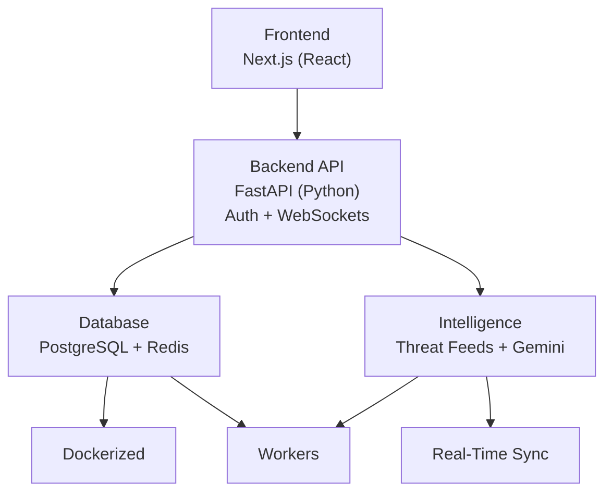

# CyberNews Product Roadmap

Source: `Cybernews.pdf`

## Product Vision

CyberNews should grow from a school project into a professional cyber threat intelligence and SOC-style dashboard.

The product should combine:

- Cybersecurity news aggregation
- Threat intelligence feeds
- CVE and vulnerability tracking
- IOC tracking
- Role-based analyst workflows
- AI-assisted analysis
- Incident management
- Real-time monitoring

## Product Identity

CyberNews is a:

- **CTI platform:** A cyber threat intelligence ecosystem.
- **SOC dashboard:** A security operations interface.
- **News and feed aggregator:** A central place for cybersecurity news and CVE feeds.
- **IOC tracker:** A place to collect and review indicators of compromise.
- **AI analysis tool:** A system that can summarize and classify threats.
- **Monitoring tool:** A dashboard for live updates and response.

## Main Goals

1. Build a professional cybersecurity dashboard.
2. Practice frontend and backend development.
3. Integrate real threat intelligence feeds.
4. Implement authentication and role-based access control.
5. Use AI to summarize and analyze threats.
6. Simulate SOC workflows.

## Target Architecture

The presentation describes an advanced target architecture:

- **Frontend:** Next.js and React
- **Backend API:** FastAPI with Python
- **Authentication:** JWT, API keys, secure sessions
- **Database:** PostgreSQL
- **Cache / queue support:** Redis
- **Intelligence feeds:** Threat feeds, CVE data, and AI enrichment
- **Real-time updates:** WebSockets
- **Workers:** Dockerized background jobs



## Current Project Reality

This school project currently uses:

- Flask
- Jinja templates
- Simple HTML, CSS, and JavaScript
- In-memory sessions and tokens
- NewsAPI integration
- Local mock intelligence data

For now, we should keep the implementation simple and beginner-friendly. The roadmap can guide feature choices without forcing a large framework migration too early.

## Google Cloud Direction

Near-term Google Cloud target:

- **Cloud Run:** host the Flask app.
- **Environment variables:** keep simple demo settings outside Git.
- **Secret Manager later:** store production secrets such as `NEWS_API_KEY` and `SECRET_KEY`.
- **Firestore later:** persist articles, advisories, reports, audit events, and graph data.
- **Vertex AI later:** generate summaries and analyst notes.

For the first live version, Cloud Run plus environment variables is enough. Firestore and Vertex AI should be added only after the current app is stable.

## Core Features To Build Toward

### News Aggregation

Collect and display cybersecurity news from sources such as:

- NewsAPI
- BSI WID RSS
- The Hacker News
- SecurityWeek
- RSS feeds

Near-term idea:

- First connect the current dashboard to live NewsAPI data.
- Then add one more cybersecurity-specific source, preferably the BSI WID RSS feed.
- Keep source filters, refresh state, and readable article cards.

### CVE Intelligence Dashboard

Track vulnerabilities and show:

- CVE ID
- Severity
- Short description
- Published date
- Exploit status
- Patch or mitigation link

Near-term idea:

- Add mock CVE data first, then later connect a real CVE source.

### IOC Management

Track indicators of compromise such as:

- IP addresses
- Domains
- Hashes
- URLs
- Email addresses

Near-term idea:

- Add an admin-only page for entering simple IOC records.

### MITRE ATT&CK Mapping

Map threats to tactics, techniques, and procedures.

Near-term idea:

- Start with a simple text field such as `technique`, for example `Phishing` or `Credential Access`.

### Incident Workflow

Create simple SOC-style cases with:

- Title
- Severity
- Status
- Assigned analyst
- Timeline notes
- Linked IOCs

Near-term idea:

- Add a basic incident list visible to logged-in users.
- Add admin-only create/delete controls.

### AI-Assisted Analysis

Use AI for:

- Threat article summaries
- IOC extraction
- Severity classification
- MITRE ATT&CK suggestions
- Detection rule generation
- Remediation recommendations

Detailed implementation spec:

- `AI_WORKBENCH_SPEC.md`

Near-term idea:

- First create a sandboxed Analyst Briefing viewport for mock AI reports.
- Later connect a real AI API once the basic workflow is clear.
- Display AI-generated HTML only inside the sandboxed iframe until sanitizing and storage rules are clear.

Simple Vertex AI flow:

1. User opens an article, advisory, or report.
2. User clicks `Generate Summary`.
3. The app first returns a mocked summary while the workflow is being designed.
4. Later, the backend sends the text to Vertex AI.
5. Vertex AI returns a short analyst summary, recommended next steps, and optional safe report HTML.
6. The app shows the result in the sandboxed Analyst Briefing viewport.

Keep this optional until the normal dashboard, feeds, and graph are stable.

## Authentication And Security

The presentation highlights:

- Secure login
- Role-based access control
- JWT authentication
- API key support
- Audit logging
- Secure sessions
- Password hashing

Current project status:

- Login exists.
- Server-side sessions exist.
- Role checks exist.
- Bearer token API exists.
- Passwords are still hardcoded and plain text.

Near-term improvements:

- Hash passwords.
- Add an audit log for login success and failure.
- Add clearer access denied pages.
- Keep session and token behavior easy to explain.

## Threat Intelligence Integration

Target sources:

- The Hacker News
- SecurityWeek
- BSI WID RSS
- CISA KEV Catalog
- EPSS scoring
- CVE enrichment
- IOC extraction

Near-term idea:

- NewsAPI and BSI WID RSS are already integrated.
- Add CISA KEV next because it gives official known exploited vulnerability data.
- Add FIRST EPSS after KEV because it gives exploit probability scores for CVEs.
- Normalize news, advisories, and vulnerabilities into simple readable shapes.

Simple article/advisory shape:

```text
title
summary
source
url
published_at
category
```

Simple vulnerability shape:

```text
cve
vendor
product
title
summary
date_added
due_date
known_ransomware_use
required_action
source
```

### Data Source Evaluation

Detailed findings are tracked in `DATA_SOURCES.md`.

These are the most useful sources right now:

| Source | Fit | Priority | Notes |
| --- | --- | --- | --- |
| NewsAPI | General cybersecurity news | Integrated | Requires `NEWS_API_KEY`. Free developer plan is useful for local development, but limited and not production-ready. |
| BSI WID RSS | Vulnerability/security advisories | Integrated | Official German advisory feed, no API key, RSS/XML format, severity values like `niedrig`, `mittel`, `hoch`, `kritisch`. |
| CISA KEV Catalog | Known exploited CVEs | Integrated | Official public JSON source for vulnerabilities known to be exploited in the wild. No key needed. |
| FIRST EPSS | Exploit probability scoring | Integrated | Public API that returns EPSS score and percentile for CVE IDs. No key needed. |
| NVD CVE API | CVE details and CVSS data | Later | Free public API. API key is recommended for better limits. Useful after KEV and EPSS are stable. |
| The Hacker News | Cybersecurity news RSS | Integrated | Public feed, useful for cyber news volume. |
| SecurityWeek | Cybersecurity news RSS | Integrated | Public RSS feed, useful for cyber news volume. |
| BleepingComputer | Cybersecurity and malware news RSS | Later | Public RSS feed, useful as an extra news source. |
| Hacker News API/RSS | Tech community signal | Later | Free public API/RSS, but not cybersecurity-specific. Better as a community signal panel. |
| URLhaus / MalwareBazaar | IOC and malware intelligence | Later | Free community/fair-use data. Useful later for malicious URLs and hashes. Do not download malware samples in this school app. |
| OpenPhish | Phishing URLs | Later | Free community feed option. Review terms before automating. |

Recommended implementation order:

1. IOC source spike with URLhaus, MalwareBazaar, or OpenPhish.
2. Mock AI enrichment before real Vertex AI calls.

## SOC Dashboard Ideas

The product should eventually feel like a small SOC cockpit.

Possible sections:

- Latest headlines
- Active vulnerabilities
- IOC watchlist
- Recent incidents
- Analyst notes
- Admin controls
- Audit log

Keep the design practical:

- Clear navigation
- Compact cards or tables
- Simple colors
- Readable status labels
- No unnecessary visual complexity

## Threat Correlation Concepts

Threat correlation should connect different security entities. It can be shown as a visual graph, or as AI-generated analyst reports and small HTML visuals in the sandboxed briefing viewport.

```text
Article -> CVE -> IOC -> Incident -> Actor -> MITRE Technique -> Affected Asset
```

This would make CyberNews feel more like an intelligence platform than a normal news dashboard.

Current direction:

- Keep graph-style data in the backend because relationships are useful.
- Do not make the visual graph the main product focus yet.
- Use the sandboxed Analyst Briefing viewport on the dashboard for generated reports, correlation summaries, and simple visuals.

### Graph Database Idea

A graph database could model relationships directly.

Possible graph nodes:

- Article
- CVE
- IOC
- Incident
- Threat actor
- MITRE technique
- Source
- Asset
- User or analyst

Possible graph edges:

- `MENTIONS`
- `EXPLOITS`
- `RELATED_TO`
- `OBSERVED_IN`
- `USES_TECHNIQUE`
- `ASSIGNED_TO`
- `AFFECTS`

For Google Cloud, possible paths are:

- **Firestore first:** Store simple node and edge documents while the project is small.
- **Neo4j Aura later:** Use a real managed graph database through Google Cloud Marketplace if graph queries become central.
- **JanusGraph + Bigtable much later:** Powerful, but too complex for this school project stage.

### Firestore Data Model Draft

Start with simple collections:

| Collection | Purpose | Example fields |
| --- | --- | --- |
| `articles` | Saved NewsAPI-style articles | `title`, `summary`, `source`, `url`, `published`, `category`, `severity` |
| `advisories` | Saved BSI advisories | `title`, `summary`, `source`, `url`, `published`, `severity` |
| `reports` | Admin-created intelligence reports | `title`, `summary`, `severity`, `created_by`, `created_at` |
| `audit_events` | Login and access events | `timestamp`, `username`, `result`, `role` |
| `graph_nodes` | Threat graph nodes | `label`, `type`, `severity`, `source_id` |
| `graph_edges` | Threat graph relationships | `source`, `target`, `label` |

Rules for the first Firestore version:

- Keep documents small and readable.
- Store only app data, not secrets.
- Keep user passwords out of Firestore until real account handling is designed.
- Keep graph nodes and edges simple before adding a real graph database.

Near-term plan:

- Build live news and vulnerability feeds before graph rendering.
- Start with a simple JSON-style graph model in Firestore or local mock data.
- Render the graph in the browser in small steps:
  - Start with readable node and relationship cards.
  - Add a visual graph shell.
  - Draw nodes.
  - Draw relationships.
  - Connect visual node selection to the details panel.
- Move to a real graph database only when the data and queries justify it.

### Graph Visualization Libraries

Useful JavaScript options:

- **Cytoscape.js:** Best first choice for this project. It supports interactive graph visualization and graph theory-style analysis.
- **Sigma.js:** Good for larger graph visualizations and WebGL rendering.
- **vis-network:** Simple and friendly for physics-based network diagrams.
- **React Flow:** Better for workflows and node editors than threat relationship graphs.

Recommended first choice:

```text
Cytoscape.js
```

Reason:

- It fits threat intelligence relationship graphs.
- It can handle nodes, edges, styling, layouts, and interaction.
- It can work in the current Flask/Jinja version and also later inside a Next.js/React frontend.

Reference links:

- Cytoscape.js: https://js.cytoscape.org/
- Sigma.js: https://www.sigmajs.org/docs/
- vis-network: https://visjs.org/index.html
- React Flow: https://reactflow.dev/

### A2UI Idea

A2UI is interesting for future AI-assisted interfaces.

It could let an AI analyst assistant generate safe, structured UI responses instead of plain text.

Possible CyberNews use cases:

- AI generates a dynamic incident triage form.
- AI creates a small IOC review panel.
- AI returns a structured threat summary card.
- AI creates a chart or graph view based on a user question.

Near-term plan:

- Do not implement A2UI yet.
- Keep the concept in the roadmap.
- First build normal Flask/Jinja pages and API routes.
- Revisit A2UI when the AI workflow is clearer.

Reference link:

- A2UI: https://a2ui.org/

## Technical Challenges

The presentation calls out these future challenges:

- Real-time data ingestion
- API normalization
- Secure authentication
- AI integration
- Granular RBAC
- Threat correlation
- WebSocket synchronization

For this school project, we should handle these gradually and avoid overbuilding.

## Suggested Next Steps

1. Review IOC source safety before adding URLhaus, MalwareBazaar, or OpenPhish.
2. Add AI-style summaries, mocked first.
3. Add simple incident tracking.
4. Connect AI summaries to articles, advisories, and CVEs.

## Development Principles

- Keep each exercise or feature in a small readable commit.
- Prefer simple Flask, Jinja, HTML, CSS, and JavaScript for now.
- Add real architecture only when the project needs it.
- Keep security features understandable and demonstrable.
- Make the app look like a real dashboard, but keep the code beginner-friendly.
